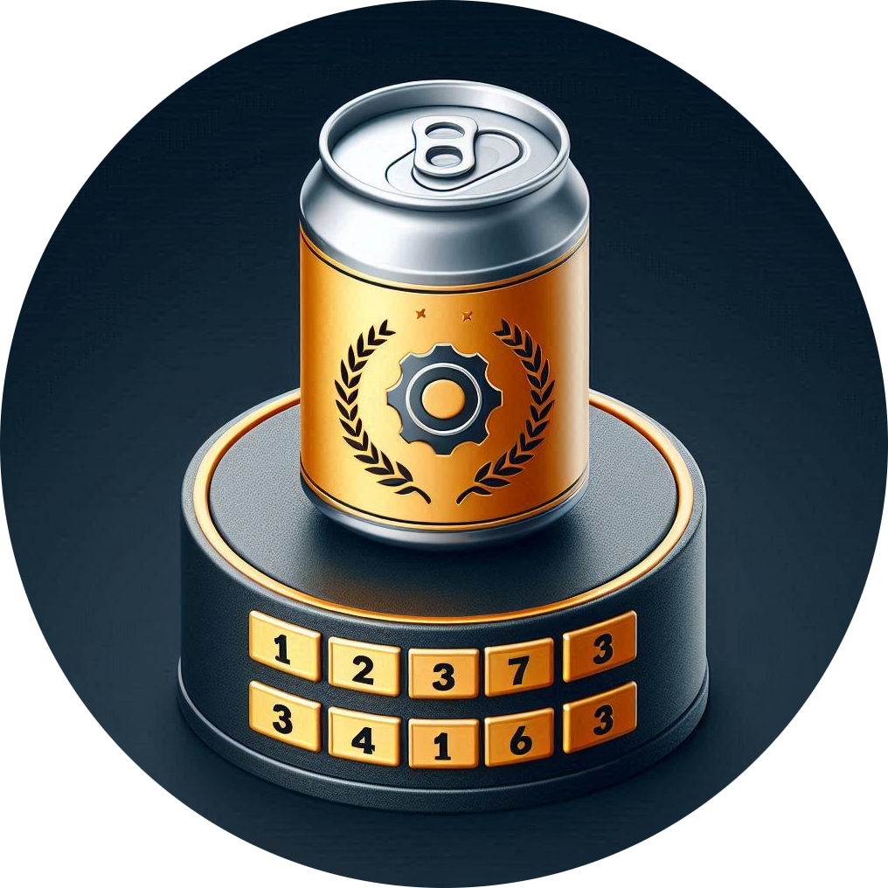

  

# SwinceBot

Your personal swince leaderboard manager ;)

## Why?

Tracking nominations quickly gets out of hand when eNgInEeRs get to do what
they do best: "Swince like there is no tomorrow".

A bot would let eNgInEeRs track who they nominate, who nominated them, their
current score, and an always up-to-date leaderboard.

## Stack

To keep shit simple, the stack is as follows:

- Go: Easy to code, lot's of library support when it comes to cloud infra
- `bwmarrin/discordgo`: A discord API wrapper I already used for [songlinkr][1]
- SQlite: No need for an always-on server for such a small project

# Ruleset

- **1 point** per hour remaining before the 24h deadline after a nomination
- Missing the 24h deadline imposes *The Late Swince Tariff* (+1 Swince) but
  will grant **+12 points** if both swinces are done
- Creating a new swince chain (swince without being nominated) grants a **+12
  points** bonus
- Ending a swince chain (Nominating nobody while doing a swince) will result in
  a **-4 points** penalty. Therefore, a solo swince (not nominated AND not
  nominating) grants a fixed **8 points** (12-4)
- *Strength in numbers*: **+4 points** bonus for every accompanying eNgInEeR
  (ex: a triple swince gives everyone +8 because each eNgInEeR has two buddies)

# Bot commands

## Create (TODO)

1. Ask the eNgInEeR for the list of people swincing in the video
2. For each user selected, ask who that user wishes to nominate (with the added
   option of "I swince for No-One")
3. For each eNgInEeR with unfulfilled duties, ask which nomination he wants to
   fulfill (including *Late Swince Tarriffs*)
3. Asks to upload the video as proof
4. Posts the video and tags the nominees

## Stats (TODO)

With no arguments, stats are for @me

Posts the following statistics about a chosen eNgInEeR:

- Swince accomplished
- How many people that he nominated
- How many nominations he got
- How many *Swince chains* he started
- How many late swinces he got (ex: "3/4 *Late Swince Tarriffs* paid")
- Average reaction time, would Buffalo Bill be proud?
  (ex: "Usually takes 6 hours to respond to his duties")
- Total points accumulated

## leaderboard

Self explanatory, user/points markdown table in decreasing order

[1]: https://github.com/ChausseBenjamin/songlinkr
